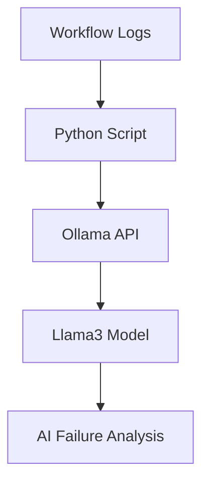

# AI Workflow Analyzer


An AI-powered DevOps workflow failure analyzer built using Python, Ollama, and Llama3.


This beginner-friendly project reads workflow logs and uses a local AI model to identify:

- probable root cause
- failed component

- suggested fix

- severity level


---


# Features


- Local AI execution using Ollama

- Workflow log analysis

- Root cause detection

- Suggested remediation steps

- Beginner-friendly setup


---


# Architecture




---


# Tech Stack


- Python

- Ollama

- Llama3

- GitHub


---


# Prerequisites


- Python 3.x

- Ollama installed

- Llama3 model downloaded


---


# Installation


## Install Ollama


Download:


https://ollama.com/download


## Pull Llama3 model


```powershell

ollama pull llama3

```


## Install Python dependencies


```powershell

python -m pip install requests

```


---


# Run the Project


## Start Ollama


```powershell

ollama run llama3

```


## Run analyzer


```powershell

python analyzer.py

```


---


# Example Use Cases


- GitHub Actions failures

- Kubernetes pod issues

- Docker build failures

- Dependency conflicts

- CI/CD troubleshooting


---


# Future Improvements


- GitHub Actions integration

- Jenkins support

- Kubernetes log analysis

- Slack/Teams alerts

- Historical failure learning

- AI-assisted remediation


---


# Learning Goal


This project was built as a beginner-friendly introduction to:

- Local LLMs
- AI-assisted DevOps
- Prompt engineering
- Python API integration


---


# Repository

https://github.com/yatnallivikas/ai-workflow-analyzer

